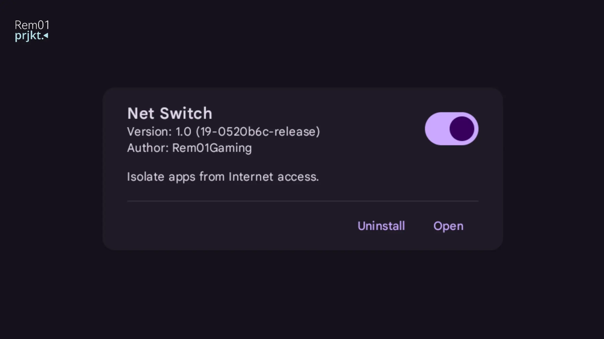
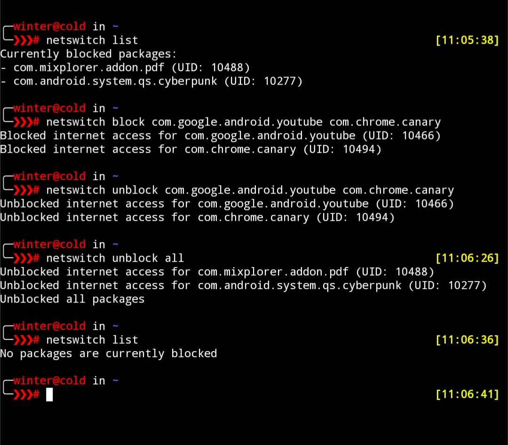

# Net Switch: Isolate Apps from Internet Access


Net Switch is a Magisk module to isolate apps from accessing the internet on your Android device. This tool gives you complete control over which apps can send or receive data, improving security, privacy, and saving bandwidth.

Fully standalone, operates fully on iptables.

## Features
- Independent per-app **Wi-Fi** and **mobile data** switches
- Per-app **custom domain/IP blocking** (block ads, trackers or any host per app)
- Operates without VPN (unlike AFWall)
- Doesn't suck on battery
- Module WebUI, redesigned in **Material Design 3 expressive** style (new in v1.4)
- **Profiles**: Save and restore sets of blocked apps
- **Backup Manager**: Save and restore created profiles

## Supported Root Managers
- [APatch](https://github.com/bmax121/APatch)
- [KernelSU](https://github.com/tiann/KernelSU)
- [Magisk](https://github.com/topjohnwu/Magisk)  <sup>([no WebUI](https://github.com/topjohnwu/Magisk/issues/8609#event-15568590949)👀)</sup>

### WebUI on Magisk
Magisk doesn't support module WebUI on their manager, but you can use one of these apps to open Net Switch WebUI.

- [KsuWebUI](https://github.com/5ec1cff/KsuWebUIStandalone)
- [MMRL](https://github.com/DerGoogler/MMRL)   <sup>👍</sup>

## Usage (WebUI)
- Flash Net Switch Module
- Reboot
- Open Net Switch WebUI
- Toggle **Wi-Fi** and **Data** independently for each app. Changes are applied immediately, no need to reboot.
- Tap the ban icon on an app to block custom domains or IP addresses for that app only.
- Create and apply **profiles** to quickly switch blocked-app sets.
- Backup and restore your profiles.

## Terminal Usage
Open Termux or any terminal with root access and run:
```bash
netswitch block-wifi <package>            # block Wi-Fi for packages
netswitch unblock-wifi <package>          # restore Wi-Fi for packages
netswitch block-mobile <package>          # block mobile data for packages
netswitch unblock-mobile <package>        # restore mobile data for packages
netswitch block <package>                 # block both Wi-Fi and mobile data
netswitch unblock <package>               # restore both Wi-Fi and mobile data
netswitch unblock all                     # restore all packages

netswitch domain-add <package> <host>     # block a domain/IP for a package
netswitch domain-remove <package> <host>  # unblock a domain/IP for a package
netswitch domain-list <package>           # show blocked domains/IPs for a package

netswitch list                            # show current isolation status
netswitch list --json                     # same, machine readable
netswitch apply                           # rebuild firewall rules from saved config
netswitch reset                           # clear all rules and saved config
```

Custom domain rules are resolved to IP addresses and re-applied automatically every 15 minutes in the background (and on boot), since a domain's IP can change over time.

Terminal Screenshot


## Building
The WebUI is a Vite project bundled and minified into a single static bundle:
```bash
cd webui
npm install
npm run build         # outputs a minified bundle to webui/dist
npm run build:deploy  # also copies the bundle into module/webroot and zips the module
```
CI (`.github/workflows/build.yml`) performs the same `build` step before packaging the flashable zip.

## Changelog
See [changelog.md](./changelog.md).

## Links

* Download [here](https://github.com/Rem01Gaming/net-switch/releases)
* [Telegram Channel](https://t.me/rem01schannel)

## Help and Support

Report [here](https://github.com/Rem01Gaming/net-switch/issues) if you encounter any issues.

[Pull requests](https://github.com/Rem01Gaming/net-switch/pulls) are always welcome.
UX/UI: [Antonio Riccio](https://github.com/Antonio-Riccio)
